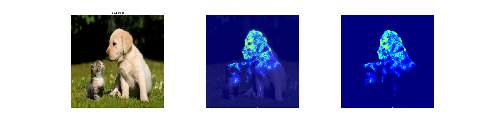
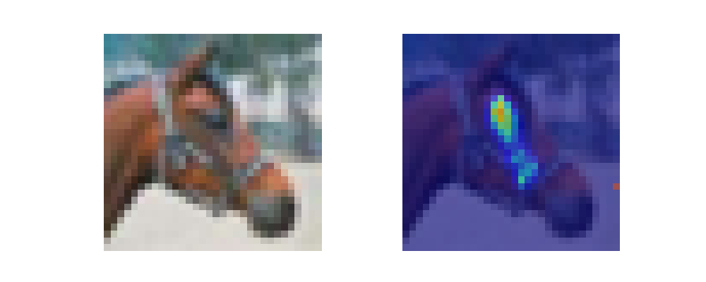

# neuromask
Implementation of ["NeuroMask: Explaining Predictions of Deep Neural Networks through Mask Learning"](https://ieeexplore.ieee.org/abstract/document/8784063)

## Install requirments

```
pip install -r requirements.txt
```

## ImageNet model experiment

Download the pre-trained model weights of `inception-v3` model

```
bash download_inceptionv3_checkpoint.sh
```

Run the demo notebook [`NeuroMaskDemo_ImageNet.ipynb`]('./NeuroMaskDemo_ImageNet.ipynb') to see an example of how to generate explanations of `inception-v3` model classifications.


Example output:


## CIFAR-10 experiment:

Download the pre-trained model weights of the CIFAR-10 classification model.

```
bash download_cifar10_model.sh
```

Run the neuromask to get explanation of the `CIFAR-10` model. Use the `test_idx` parameter to provide an index of a test example from the CIFAR-10 test dataset.

```
 python neuromask_cifar10_demo.py --test_idx=xx
```

Example output:

---
## Maintainer:
* This project is maintained by: Moustafa Alzantot [(malzantot)](https://github.com/malzantot)
